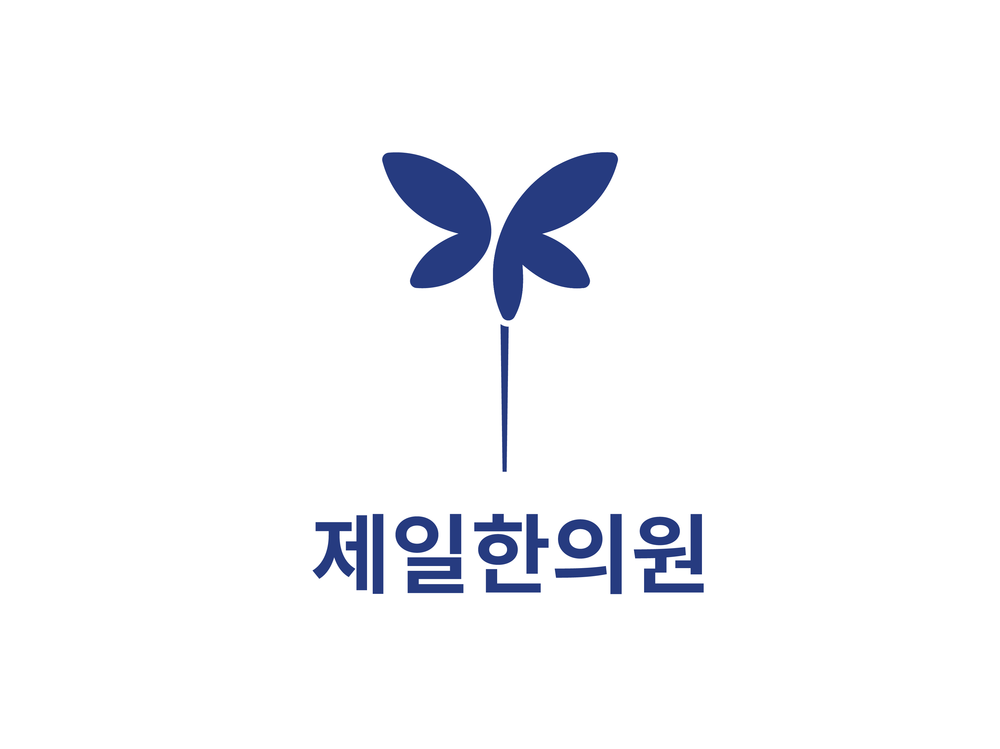

# 제일한의원 브랜드 아이덴티티

## 브랜드 스토리

하나의 침이 나비가 됩니다.

52년간 이어온 치유의 손길을 한 자루의 침에 담았습니다. 그 침 위로 다섯 장의 날개가 피어납니다. 목(木)·화(火)·토(土)·금(金)·수(水), 한의학의 근본인 오행이 다섯 날개가 되어 균형과 조화를 이룹니다.

비대칭의 날개는 전통 위에 새로운 감각이 더해지는 순간을, 시그니처 블루는 신뢰를 담았습니다. 침과 나비, 치료와 아름다움, 전통과 현대가 하나의 형태 안에서 만납니다.

## 디자인 요소

- **심볼**: 나비/잎의 유기적 곡선(순환·변화·가벼움) + 중앙의 침 형태(정밀한 치료·전문성)
- **컬러**: 딥 네이비 `#263c81` — 신뢰·차분함·의료적 청결감
- **구성**: 심볼과 워드마크의 절제된 배치로 '조용히 증명하는 제일'이라는 브랜드 태도를 완성
